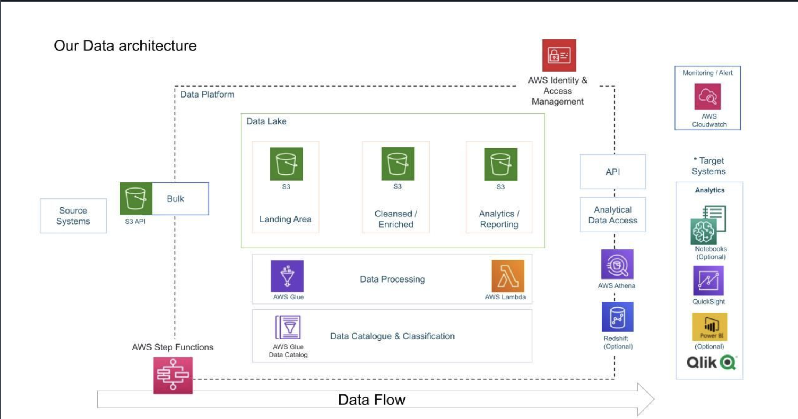

# Youtube Trend Data Analysis
This project securely manages, processes, and analyzes structured and semi-structured data from YouTube, specifically focusing on video categories and trending metrics. The project aims to build a robust analytics platform utilizing AWS cloud services for scalable data ingestion, transformation, storage, and visualization.

## Project Goals

- **Data Ingestion:** Create mechanisms to ingest data seamlessly from multiple sources.

- **ETL Pipeline:** Convert raw data into standardized and analysis-ready formats.

- **Centralized Data Lake:** Establish a centralized repository for data collected from various sources.

- **Scalability:** Ensure the system scales effortlessly with the growing volume of data.

- **Cloud-based Processing:** Leverage AWS cloud services to efficiently process extensive datasets.

- **Visualization and Reporting:** Develop insightful dashboards to address business and analytical questions.

## Architecture & Data Flow

- ### Data Ingestion

**AWS S3 (Landing Area):** Raw data from Kaggle and other sources is initially stored in Amazon S3 buckets.

- ### Data Transformation & ETL Processing

**AWS Glue:** Processes structured CSV files into Parquet format.

**AWS Lambda:** Transforms unstructured JSON files into Parquet format.
- ### Data Storage (Data Lake Structure)

**S3 Cleansed/Enriched Bucket:** Stores transformed datasets in Parquet format.

**S3 Analytics/Reporting Bucket:** Contains optimized Parquet datasets for analytical queries.

- ### Data Cataloging & Classification

**AWS Glue Data Catalog:** Centralized metadata repository for datasets.

- ### Analytical Data Access & Querying

**AWS Athena:** Serverless SQL-based queries directly on S3 datasets.

- ### Identity & Access Management

**AWS IAM: Secure management of access permissions.

- ### Visualization & Reporting

**Amazon QuickSight:** Interactive dashboards for insightful visual analytics.

- ### Monitoring & Alerting

**AWS CloudWatch:** Real-time monitoring, logging, and alerting system.

## Architecture Diagram

